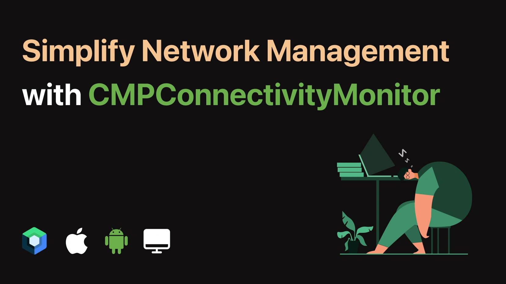

# Compose Multiplatform Connectivity Monitor
[](https://central.sonatype.com/artifact/network.chaintech/compose-connectivity-monitor)
[](http://kotlinlang.org)
[](https://github.com/JetBrains/compose-multiplatform)


CMPConnectivityMonitor is a Compose Multiplatform library that provides seamless network connectivity monitoring for Android, iOS and Desktop platforms. It helps you easily detect and respond to changes in network status within your Compose Multiplatform applications.



## Features
- Monitors network connectivity status in real-time.
- Supports both Wi-Fi and Cellular network types.
- Provides connectivity status updates via a simple and consistent API.
- Supports iOS, Android and Desktop platforms.

## Installation

Add the following dependency to your `build.gradle.kts` file:

```kotlin
commonMain.dependencies {
    implementation("network.chaintech:compose-connectivity-monitor:1.0.1")
}
```
## Setup
### Android
In your AppActivity, initialize the ConnectivityMonitor:
```kotlin
class AppActivity : ComponentActivity() {
    override fun onCreate(savedInstanceState: Bundle?) {
        super.onCreate(savedInstanceState)
        ConnectivityMonitor.initialize(this)
    }
}
```
## Usage
#### Initialize the Connectivity Monitor
Create an instance of ConnectivityMonitor in your shared code:
```kotlin
val connectivityMonitor = ConnectivityMonitor.instance
```
#### Start Monitoring
Start monitoring network connectivity:

```kotlin
connectivityMonitor.startMonitoring()
```
#### Stop Monitoring
Stop monitoring network connectivity when it is no longer needed:

```kotlin
connectivityMonitor.stopMonitoring()
```
#### Hard Refresh
Perform a hard refresh to recheck the current network status:

```kotlin
connectivityMonitor.refresh()
```
#### Observe Connectivity Status
Use a StateFlow to observe the connectivity status:

```kotlin
val connectivityStatus: StateFlow<ConnectivityStatus> = connectivityMonitor.status
```
You can then use this state in your Compose UI:
```kotlin
@Composable
fun ConnectivityStatusView() {
    val status by connectivityMonitor.status.collectAsState()

    when (status) {
        ConnectivityStatus.CONNECTED,
        ConnectivityStatus.CONNECTED_VIA_CELLULAR,
        ConnectivityStatus.CONNECTED_VIA_WIFI -> {
            // Show connected UI
        }
        ConnectivityStatus.NOT_CONNECTED,
        ConnectivityStatus.CONNECTED_VIA_CELLULAR_WITHOUT_INTERNET,
        ConnectivityStatus.CONNECTED_VIA_WIFI_WITHOUT_INTERNET -> {
            // Show disconnected UI
        }
        ConnectivityStatus.DETERMINING -> {
            // Show loading or determining UI
        }
    }
}
```
### Connectivity Status
The ConnectivityStatus enum provides various states to represent the connectivity status:

- CONNECTED
- CONNECTED_VIA_CELLULAR
- CONNECTED_VIA_CELLULAR_WITHOUT_INTERNET
- CONNECTED_VIA_WIFI
- CONNECTED_VIA_WIFI_WITHOUT_INTERNET
- DETERMINING
- NOT_CONNECTED

## Detailed Explanation
For an in-depth guide and detailed explanation, check out our comprehensive Medium Blog Post.

[](https://medium.com/mobile-innovation-network/simplify-network-management-with-cmpconnectivitymonitor-in-compose-multiplatform-2af9c13c04f5)  
[](https://www.linkedin.com/showcase/mobile-innovation-network)

